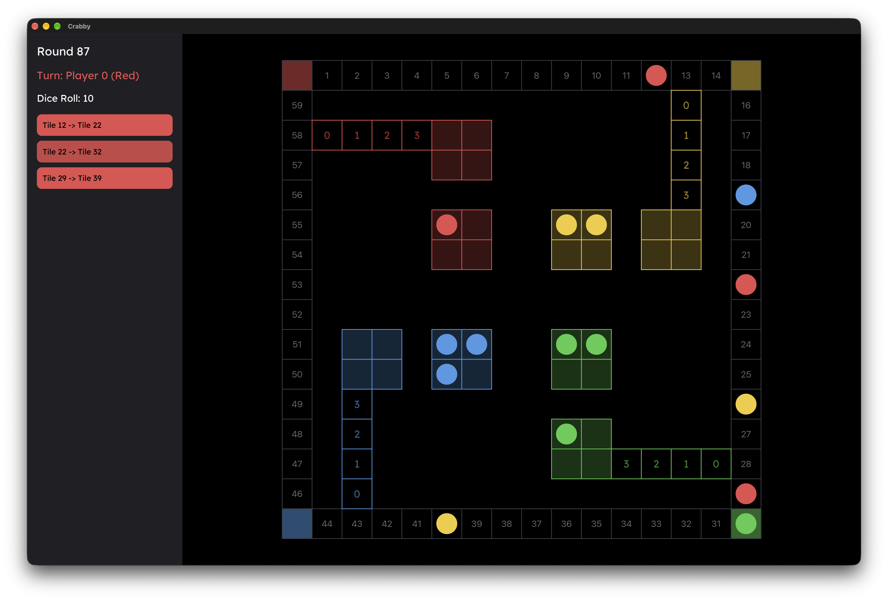

# Crabby
- Iced remake of a fun childhood game with a bit more automation in gameplay

### Storytime
- Basically I was playing an old not-to-be-named game on max difficulty and I was sure the AI was cheating with its dice rolls, like even when I was playing completely optimally with 3 humans against it, it would get BS rolls all the time
- Also just wanted to stop using compatability layers to be able to play the game

### Todo
- [ ] Finish the roll logic
- [ ] Add a basic AI that just chooses the first option
- [ ] Add an intermediate AI that calculates the total distance left for all of its pieces for each option and chooses the min distance for itself
- [ ] Add an expert AI that also factors in oponents positions/total distance remaining

### Demo
